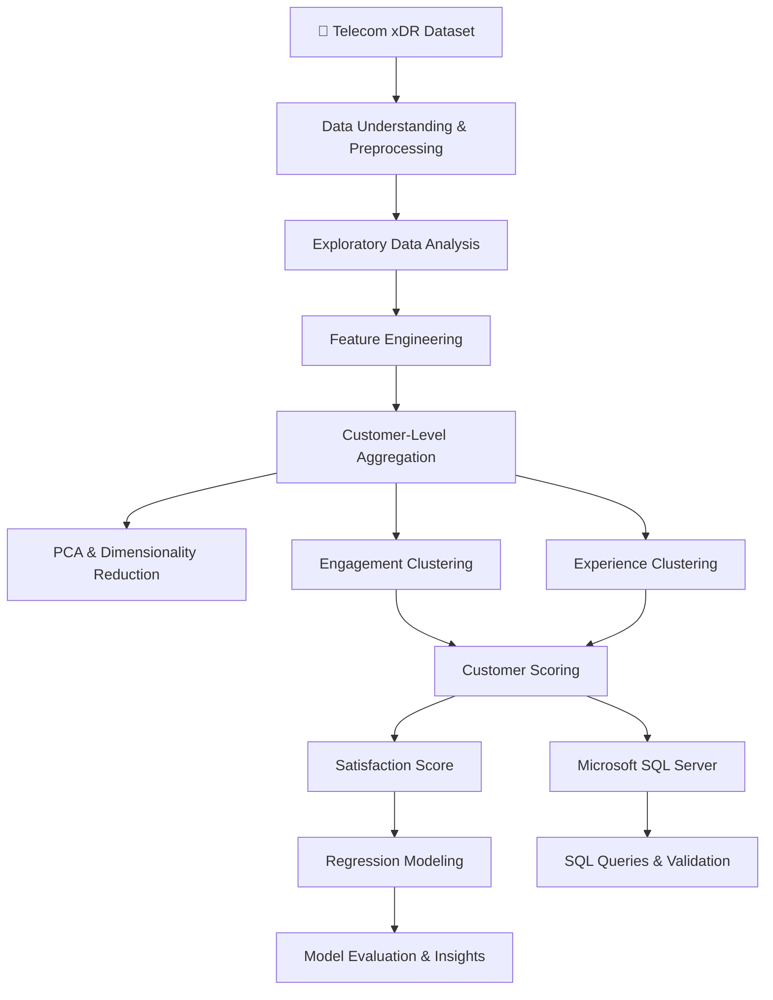
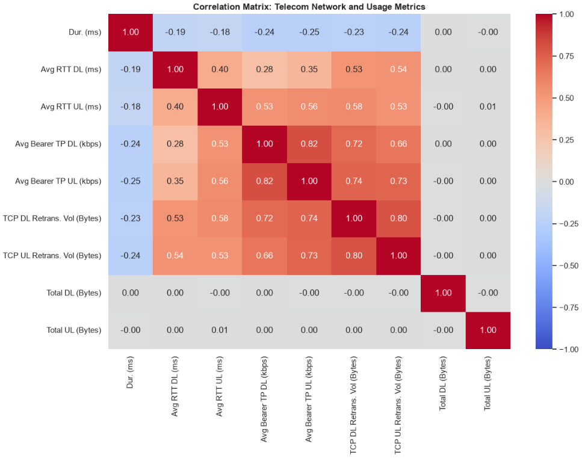
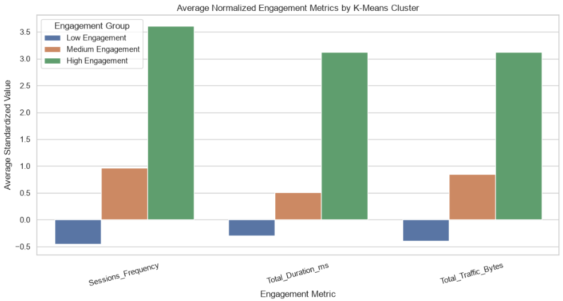
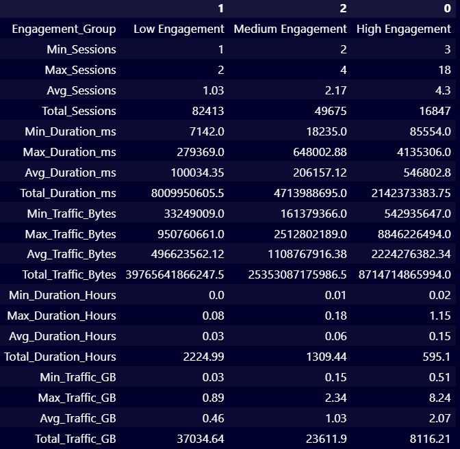
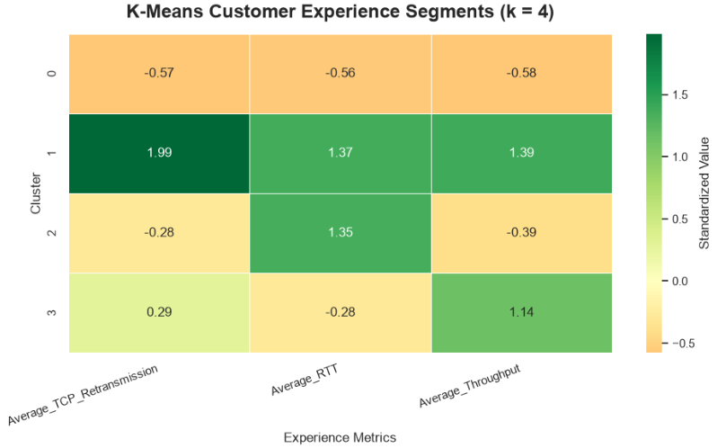
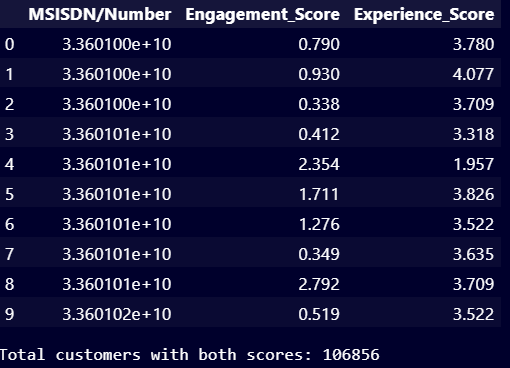
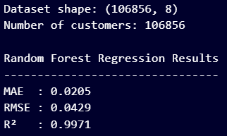
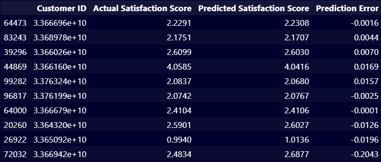
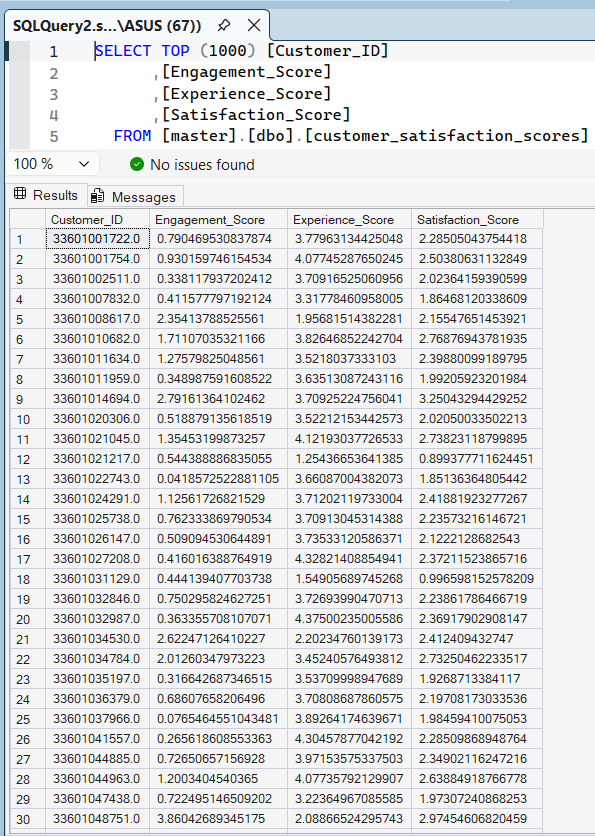
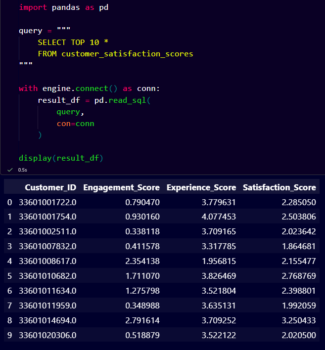

# 📡 Telecom Customer Analytics & Satisfaction Prediction

<p align="center">
  
  
  
  
  
</p>

<p align="center">
  <b>End-to-end telecom analytics using Python, machine learning, and SQL Server.</b>
</p>

---

## 📌 Project Overview

This project focuses on analyzing telecom customer behavior, understanding network service experience, segmenting customers into meaningful groups, and developing a data-driven customer satisfaction scoring framework.

Using customer-level data derived from telecom experience records (xDR), the project explores usage patterns, network performance, customer engagement, and potential opportunities for improving customer retention and service quality.

The workflow combines **Exploratory Data Analysis (EDA), Feature Engineering, PCA, K-Means Clustering, Regression Modeling, and Microsoft SQL Server integration** to transform raw telecom data into actionable insights.

## 🎯 Business Objectives

- Analyze customer usage patterns and telecom service behavior.
- Identify highly engaged and least-engaged customer segments.
- Evaluate network experience using latency, throughput, and TCP retransmission.
- Segment customers based on engagement and experience.
- Construct customer engagement, experience, and satisfaction scores.
- Develop a regression model to predict the constructed satisfaction score.
- Store and retrieve customer-level scores using SQL Server.
- Identify potential customer retention and network optimization opportunities.

## 📂 Dataset Overview

The project uses a telecom xDR dataset containing approximately **150,001 records and 55 features**.

The data includes session information, customer identifiers, handset details, network performance metrics, and application-level traffic.

| Feature Category | Description |
|---|---|
| Customer Information | MSISDN, IMSI, IMEI |
| Session Information | Session start/end, duration |
| Network Performance | RTT, throughput, TCP retransmission |
| Traffic | Total download and upload bytes |
| Application Usage | Social Media, Google, Email, YouTube, Netflix, Gaming, Others |
| Device Information | Handset type and manufacturer |

### Key Metrics

| Metric | Description |
|---|---|
| Sessions Frequency | Number of sessions per customer |
| Total Duration | Aggregate session duration |
| Total Traffic | Combined download and upload traffic |
| Average RTT | Average round-trip time |
| Average TCP Retransmission | Average retransmitted TCP data |
| Average Throughput | Average download and upload throughput |

> **Note:** Customer identifiers are used to aggregate session-level records into customer-level observations. Missing or invalid customer IDs should not be treated as a single customer during aggregation.

## 🛠️ Technology Stack

| Tool / Library | Purpose |
|---|---|
| Python | Data analysis and modeling |
| Pandas | Data manipulation and aggregation |
| NumPy | Numerical computations |
| Matplotlib | Data visualization |
| Seaborn | Statistical visualization |
| Scikit-learn | PCA, clustering, preprocessing, regression, evaluation |
| SQLAlchemy | Database connectivity |
| PyODBC | SQL Server connectivity |
| Microsoft SQL Server | Storing and querying customer scores |
| Jupyter Notebook | Interactive analysis |

## 🔄 Project Workflow



## 📊 1. Data Preprocessing

Prepared the dataset for analysis and machine learning.

Key activities included:

- Inspecting dataset dimensions, data types, and statistical summaries.
- Examining missing values and handling them using appropriate strategies.
- Checking for duplicate records and inconsistent values.
- Converting columns to appropriate numeric and datetime data types.
- Investigating outliers in network and traffic-related variables.
- Preparing relevant features for customer-level aggregation.

The preprocessing stage ensures that the subsequent analysis uses consistent and meaningful data.

## 🔎 2. Exploratory Data Analysis (EDA)

Performed univariate and multivariate analysis to understand telecom usage and network behavior.

### Analysis performed

- Distribution of session duration and traffic.
- Customer activity and session frequency.
- Handset manufacturer and handset model analysis.
- Application-level download and upload traffic.
- Network latency and throughput distributions.
- TCP retransmission patterns.
- Correlation analysis between numerical features.
- Identification of unusual values and potential performance issues.

### 📷 EDA Screenshots

Add your notebook charts to the `screenshots/` folder.

| Analysis | Screenshot |
|---|---|
| Dataset Overview | `screenshots/dataset_overview.png` |
| Missing Values | `screenshots/missing_values.png` |
| Handset Analysis | `screenshots/handset_analysis.png` |
| Application Traffic | `screenshots/application_traffic.png` |
| Correlation Heatmap | `screenshots/correlation_heatmap.png` |

Example:

```markdown

```

## ⚙️ 3. Feature Engineering

Created meaningful features to support customer-level analysis.

### Application Traffic

Calculated total traffic for each application:

**Total Application Traffic = Download Traffic + Upload Traffic**

Application categories include:

- Social Media
- Google
- Email
- YouTube
- Netflix
- Gaming
- Others

### Customer-Level Features

Aggregated session records using the customer identifier (`MSISDN/Number`).

| Feature | Description |
|---|---|
| `Sessions_Frequency` | Total sessions per customer |
| `Total_Duration_ms` | Total session duration |
| `Total_DL_Bytes` | Total download traffic |
| `Total_UL_Bytes` | Total upload traffic |
| `Total_Traffic_Bytes` | Total download + upload traffic |
| `Average_TCP_Retransmission` | Average TCP retransmission |
| `Average_RTT` | Average round-trip time |
| `Average_Throughput` | Average throughput |

These features form the foundation for customer engagement and experience segmentation.

## 👥 4. Customer Engagement Analysis

### Methodology

Used **K-Means Clustering** to group customers based on:

- Session frequency
- Total session duration
- Total traffic

The features were standardized before clustering to prevent differences in measurement scales from dominating the distance calculations.

The elbow method was used to select **K = 4** for the final engagement segmentation.

### Engagement Segments

| Cluster | Segment | Interpretation |
|---|---|---|
| Cluster 0 | Least Engaged | Relatively low session frequency, duration, and traffic |
| Cluster 1 | Moderate Engagement | Moderate customer activity |
| Cluster 2 | High Engagement | High customer activity and usage |
| Cluster 3 | Very High Engagement | Highest relative engagement metrics |

Cluster numbers are model-generated labels and do not inherently represent a ranking. The segment names are assigned based on the observed cluster characteristics.

### 📷 Engagement Analysis Screenshots





## 📶 5. Customer Experience Analysis

### Methodology

Applied K-Means clustering to customer-level network experience metrics:

- Average TCP retransmission
- Average RTT
- Average throughput

These features represent different aspects of network performance.

| Metric | General Interpretation |
|---|---|
| TCP Retransmission | Higher retransmission may indicate data delivery issues |
| RTT | Higher RTT indicates greater round-trip latency |
| Throughput | Higher throughput generally indicates faster data transfer capacity |

The experience analysis used **K = 4 clusters** to identify groups with different network performance characteristics.

### Key Findings

- Cluster 1 had the highest average TCP retransmission and RTT among the four clusters.
- Cluster 2 showed elevated RTT alongside relatively low throughput.
- Cluster 3 showed relatively high throughput and lower RTT.
- Cluster 0 had below-average values for the three standardized metrics.

Cluster 1 was identified as the worst-experience cluster using the project's defined Poor Experience Index.

> Network experience is multidimensional. A cluster should not be assessed using throughput alone, and high throughput does not necessarily imply low latency or low retransmission.

### 📷 Experience Analysis Screenshots





## 🧮 6. Customer Engagement, Experience & Satisfaction Scores

The project constructs customer-level scores using the results of the clustering analysis.

### Engagement Score

Calculated as the Euclidean distance between a customer's standardized engagement feature vector and the centroid of the least-engaged cluster.

### Experience Score

Calculated as the Euclidean distance between a customer's standardized experience feature vector and the centroid of the identified worst-experience cluster.

### Satisfaction Score

The final constructed score is calculated as:

\[
\text{Satisfaction Score} =
\frac{\text{Engagement Score}+\text{Experience Score}}{2}
\]

### Important Interpretation

These scores are **distance-based analytical proxies**, not direct positive ratings.

A larger distance from a reference centroid does not automatically mean better engagement or better network experience. In particular, a larger distance from the worst-experience centroid does not necessarily indicate a better experience.

The satisfaction score is therefore a constructed analytical target, not a measurement obtained from customer surveys or actual customer satisfaction feedback.

## 🤖 7. Satisfaction Score Prediction

### Objective

Develop a regression model to predict the constructed satisfaction score using customer engagement and network experience metrics.

### Input Features

**Engagement features**
- `Sessions_Frequency`
- `Total_Duration_ms`
- `Total_Traffic_Bytes`

**Experience features**
- `Average_TCP_Retransmission`
- `Average_RTT`
- `Average_Throughput`

**Target variable:** `Satisfaction_Score`

### Model

Random Forest Regressor

The dataset was split into training and testing sets using an 80:20 split, with `random_state=42`.

### Evaluation Metrics

| Metric | Purpose |
|---|---|
| MAE | Measures average absolute prediction error |
| RMSE | Penalizes larger prediction errors |
| R² Score | Measures the proportion of target variance explained by the model |

### Model Interpretation

The regression model estimates the project's constructed score from the underlying customer metrics.

Because the target score is derived from the same engagement and experience data, the prediction task is not an independent validation of real-world customer satisfaction. The results should be interpreted as prediction of an engineered analytical target.

### 📷 Model Evaluation Screenshots





> Add your actual MAE, RMSE, and R² results from the notebook before publishing the repository.

## 🗄️ 8. Microsoft SQL Server Integration

Integrated the final customer-level scores with Microsoft SQL Server using SQLAlchemy and PyODBC.

### Database Details

| Item | Value |
|---|---|
| Database | `telecom_db` |
| Table | `customer_satisfaction_scores` |
| Database System | Microsoft SQL Server |
| Connection | Windows Authentication |
| Data Transfer | Pandas `to_sql()` |

### Table Structure

| Column | Description |
|---|---|
| `Customer_ID` | Customer identifier |
| `Engagement_Score` | Engagement distance score |
| `Experience_Score` | Experience distance score |
| `Satisfaction_Score` | Constructed satisfaction score |

### Exporting the Data

```python
final_scores.to_sql(
    name="customer_satisfaction_scores",
    con=engine,
    if_exists="replace",
    index=False,
    chunksize=1000
)
```

### Querying the Data

```sql
SELECT TOP 10 *
FROM customer_satisfaction_scores;
```

### Verifying the Number of Records

```sql
SELECT COUNT(*) AS Total_Customers
FROM customer_satisfaction_scores;
```

### 📷 SQL Server Screenshots





## 💡 9. Business Insights & Recommendations

The analysis highlights several potential areas for telecom business improvement.

### Customer Engagement

- Identify least-engaged customers for targeted retention campaigns.
- Develop usage-based offers for customers with lower activity.
- Study the behavior of highly engaged customers to understand their service needs.

### Network Optimization

- Investigate locations and customer groups with high RTT and TCP retransmission.
- Assess capacity and coverage in areas associated with poor experience.
- Monitor throughput and latency together rather than relying on a single metric.

### Customer Retention

- Combine engagement and experience indicators to identify customers who may need attention.
- Validate analytical segments against actual churn and retention outcomes.
- Use customer feedback and survey data to improve the satisfaction measurement framework.

### Acquisition Assessment

The analytics indicate potential operational improvement opportunities, but they do not establish whether an acquisition would create shareholder value.

Any acquisition decision should also consider revenue, profitability, cash flow, debt, customer churn, network assets, regulatory obligations, purchase price, and expected returns.

**Recommendation:** Continue to due diligence, and proceed with a purchase only if the financial and operational evidence supports the investment.

## 📈 10. Key Project Outcomes

- Analyzed approximately 150,001 telecom xDR records.
- Explored customer usage, handset characteristics, and network performance.
- Created application-level and customer-level analytical features.
- Segmented customers into four engagement clusters.
- Segmented customers into four experience clusters.
- Constructed engagement, experience, and satisfaction scores.
- Developed a Random Forest regression workflow.
- Integrated customer scores with Microsoft SQL Server.
- Identified potential customer retention and network optimization opportunities.

## 📁 Repository Structure

```text
telecom-customer-analytics/
│
├── README.md
├── notebooks/
│   └── telecom_customer_analysis.ipynb
│
├── screenshots/
│   ├── dataset_overview.png
│   ├── missing_values.png
│   ├── handset_analysis.png
│   ├── application_traffic.png
│   ├── correlation_heatmap.png
│   ├── engagement_clusters.png
│   ├── engagement_distribution.png
│   ├── experience_clusters.png
│   ├── network_experience.png
│   ├── regression_evaluation.png
│   ├── actual_vs_predicted.png
│   ├── sql_server_table.png
│   └── sql_query_results.png
│
├── sql/
│   └── customer_satisfaction_queries.sql
│
└── requirements.txt
```

*Adjust the filenames and folders to match your actual repository.*

## ⚙️ Installation & Setup

### 1. Clone the Repository

```bash
git clone https://github.com/YOUR_USERNAME/YOUR_REPOSITORY.git
cd YOUR_REPOSITORY
```

### 2. Create a Virtual Environment

```bash
python -m venv venv
```

Activate it on Windows:

```bash
venv\Scripts\activate
```

### 3. Install Dependencies

```bash
pip install pandas numpy matplotlib seaborn scikit-learn jupyter sqlalchemy pyodbc
```

Alternatively, install from the project's `requirements.txt`:

```bash
pip install -r requirements.txt
```

### 4. Launch Jupyter Notebook

```bash
jupyter notebook
```

Open the notebook in the `notebooks/` directory.

### 5. Configure SQL Server

- Install Microsoft SQL Server and the required ODBC driver.
- Update the server and database names in the connection code.
- Ensure Windows Authentication is configured correctly.
- Run the SQL export section of the notebook.

> The original dataset is not included in this repository. Add your own authorized copy of the dataset before running the analysis.

## 📦 Requirements

Create a `requirements.txt` file containing the libraries used in the project:

```text
pandas
numpy
matplotlib
seaborn
scikit-learn
jupyter
sqlalchemy
pyodbc
```

The Microsoft ODBC Driver for SQL Server must be installed separately from the Python packages.

## ⚠️ Limitations

- The analysis is based on the available telecom xDR data and its recorded time period.
- Customer-level metrics may conceal session-level variation.
- K-Means results depend on feature selection, scaling, and cluster initialization.
- Cluster IDs are arbitrary and may change between model runs.
- The satisfaction score is engineered and is not based on direct customer feedback.
- Regression performance on the constructed target does not establish predictive validity for actual satisfaction or churn.
- Business and acquisition recommendations require additional financial, operational, and market data.

## 🚀 Future Improvements

- Validate satisfaction scores against customer survey data.
- Incorporate churn labels to build a customer churn prediction model.
- Evaluate clustering stability and alternative clustering algorithms.
- Perform geographic network-quality analysis.
- Build an interactive dashboard using Power BI or Streamlit.
- Automate data ingestion and scheduled customer scoring.
- Add model validation, monitoring, and reproducibility checks.

## 👨‍💻 Author

**Saayan Samanta**

Aspiring Data Scientist | Python | Machine Learning | SQL | Data Analytics

- GitHub: [YOUR_GITHUB_PROFILE](https://github.com/YOUR_USERNAME)
- LinkedIn: [YOUR_LINKEDIN_PROFILE](https://www.linkedin.com/)

## 🙏 Acknowledgements

This project was completed as part of a telecom data analytics and machine learning workflow, applying data science techniques to customer behavior and network experience analysis.

---

## ⭐ Support This Project

If you found this project helpful or learned something from it, please consider giving this repository a **star** ⭐ on GitHub!

Your support motivates me to keep learning, building, and sharing more data science and machine learning projects.

<p align="center">
  <a href="https://github.com/YOUR_USERNAME/YOUR_REPOSITORY">
    
  </a>
</p>

<p align="center">
  <b>Thanks for visiting! Happy Learning & Coding 🚀</b>
</p>

---

<p align="center">
  <b>Turning Telecom Data into Actionable Customer Insights 📊</b>
</p>
